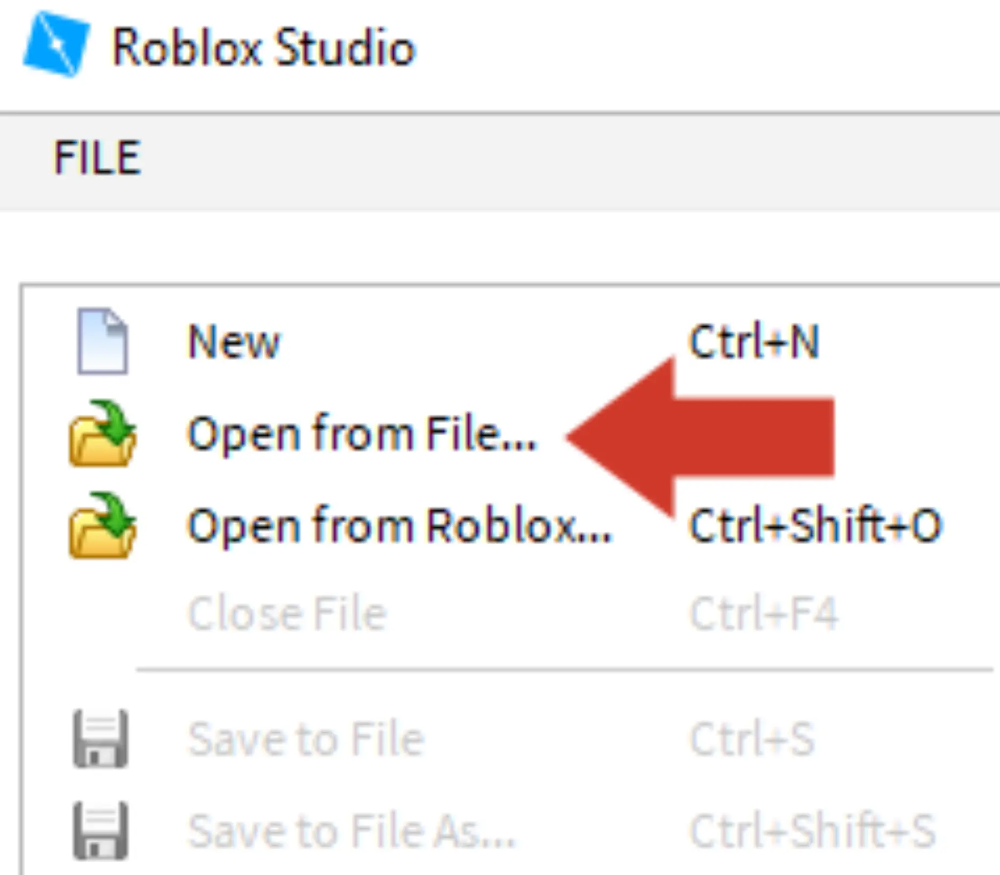
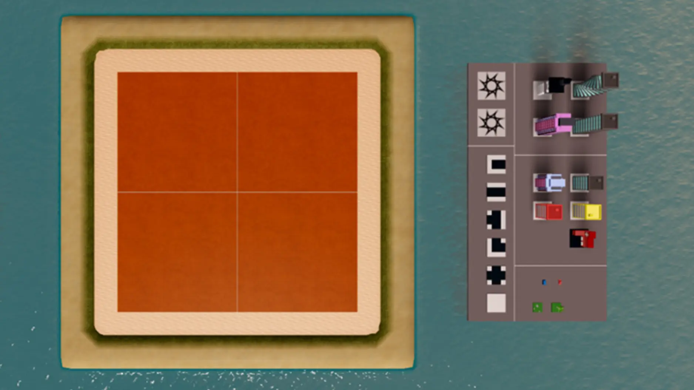

# Create and Destroy

## 목차
- [Create and Destroy](#create-and-destroy)
  - [목차](#목차)
  - [대칭 맵 디자인](#대칭-맵-디자인)
  - [템플릿 열기](#템플릿-열기)
  - [템플릿에 대하여](#템플릿에-대하여)
  - [출처](#출처)
  - [다음](#다음)

---

대부분의 인기 있는 경험은 서로 다른 기술을 가진 사람들이 팀을 이루어 함께 만듭니다. 팀에서의 한 역할은 게임 개발에서 흔히 볼 수 있는 **레벨 디자이너**입니다.

레벨 디자이너는 게임 환경을 구성하고, 지형을 그리며, 소품을 배치하고, 건물을 추가합니다. 경쟁적인 경험에서는 모든 플레이어에게 공정하고 균형 잡힌 지도를 만드는 것이 중요합니다. 이번 챌린지에서는 여러분이 레벨 디자이너가 되어 빈 스타터 맵을 파괴하기 좋은 도시로 바꾸게 될 것입니다.

## 대칭 맵 디자인

멀티플레이어 맵이 공정하게 설계되었는지 확인하기 위해 레벨 디자이너들이 사용하는 한 가지 기법은 맵의 절반을 만들고 이를 복제하여 두 번째 절반을 만드는 것입니다. 이는 맵을 두 개의 대칭적인 절반으로 나누기 때문에 대칭 디자인이라고 불립니다.

아래 비디오에서 도시의 한 절반이 복사되어 전체 맵이 만들어지는 과정을 확인해보세요.

<video controls src="../img/06_02_Create_and_Destroy/cc2019_showDuplicateCity.mp4" width="100%"></video>

## 템플릿 열기

이제 Roblox Studio를 열 시간입니다! 필요하다면 <a href = "https://www.roblox.com/create">Studio를 다운로드</a>하고 준비가 되면 이 페이지로 돌아오세요. 이번 경험에서는 아래에서 다운로드할 수 있는 Create and Destroy 템플릿을 사용합니다.

1. Roblox Studio를 열고 로그인하세요.
2. 템플릿을 다운로드하세요.

   <a href="https://prod.docsiteassets.roblox.com/assets/education/build-it-play-it-create-and-destroy/CreateAndDestroy_template.rbxl">
   <Button variant="contained">템플릿 다운로드</Button>
   </a>

3. Roblox Studio에서 왼쪽 상단에 있는 파일 > 파일에서 열기를 클릭하고 다운로드한 파일을 선택하세요.

   

## 템플릿에 대하여

이 템플릿에서는 소품 아티스트와 코더가 이미 스타터 맵을 만들어 놓았으며, 여러분은 도시를 디자인하기만 하면 됩니다. 왼쪽에는 섬이 있고, 오른쪽에는 사용할 객체들의 팔레트가 있습니다. 이러한 설정은 게임 개발에서 매우 흔합니다.

---
## 출처
[Create and Destroy](https://create.roblox.com/docs/ko-kr/education/build-it-play-it-create-and-destroy/designing-a-map)

---
## [다음](06_03_Snap_to_Grid.md)
