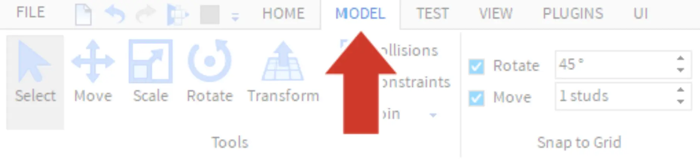
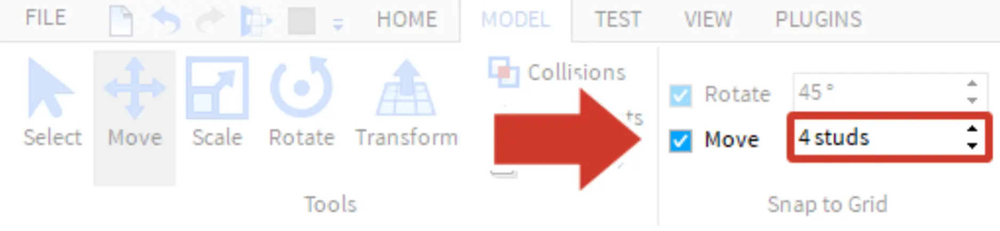
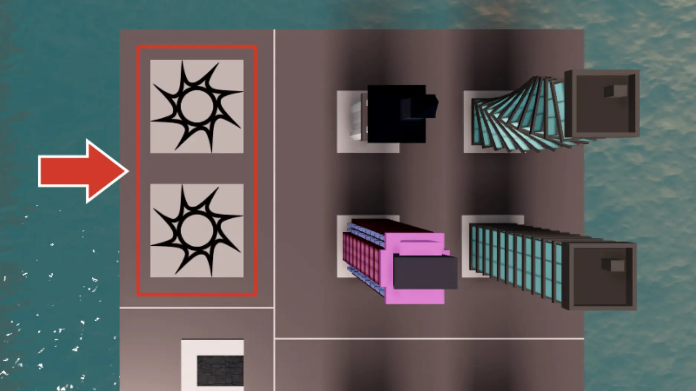
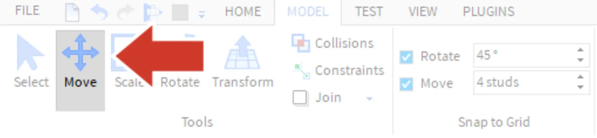
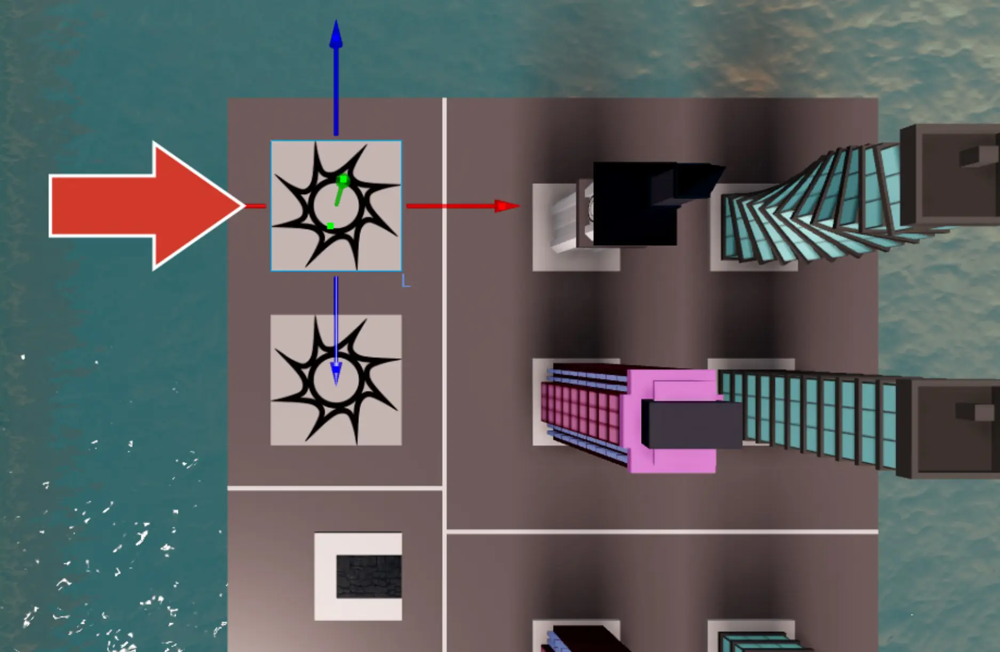
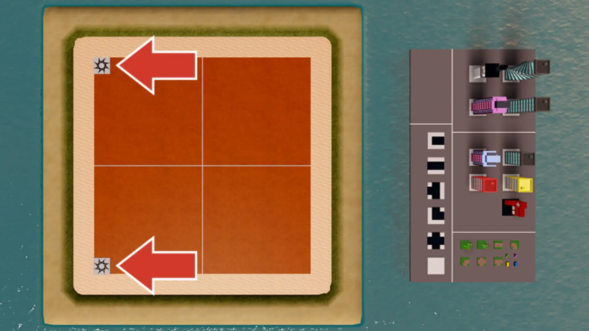

# Snap to Grid

## 목차
- [Snap to Grid](#snap-to-grid)
  - [목차](#목차)
  - [시작 지점 배치하기](#시작-지점-배치하기)
  - [첫 번째 SpawnLocation 배치하기](#첫-번째-spawnlocation-배치하기)
  - [두 번째 SpawnLocation 배치하기](#두-번째-spawnlocation-배치하기)
  - [출처](#출처)
  - [다음](#다음)

---

팔레트에 있는 타일 조각은 그리드에 정렬되어 있어 깔끔하게 맞춰집니다. 그리드에 맞추기 쉽게 하기 위해 **그리드에 맞춤(Snap to Grid)** 설정을 조정합니다. 그리드에 맞춤은 객체를 한 번에 이동하거나 회전할 수 있는 정도를 제어합니다. 기본적으로 이동 도구는 객체를 한 번에 1 스터드만큼만 이동시킬 수 있습니다.

작은 타일은 4x4이고 큰 타일은 8x8이므로, **이동(Move)** 설정을 4 스터드로 변경하면 타일을 서로 맞추기 쉽게 할 수 있습니다.

1. **모델(Model)** 탭을 선택합니다.
   

2. '1 stud'라고 적힌 부분을 클릭하고 **4**를 입력합니다.
   

## 시작 지점 배치하기

맵을 디자인할 때는 시작 위치와 가장 중요한 맵 요소들부터 시작합니다.

Roblox Studio에서 플레이어 시작 위치는 SpawnLocation 객체를 사용하여 설정됩니다. 사용할 수 있도록 두 개의 SpawnLocation 객체가 팔레트에 있습니다.

## 첫 번째 SpawnLocation 배치하기

1. 모델 탭에서 **이동(Move)** 도구를 선택합니다.
   

2. 팔레트에서 SpawnLocation 중 하나를 선택합니다.
   

3. 빨간색과 파란색 화살표를 사용하여 첫 번째 SpawnLocation을 섬으로 끌어다 놓습니다. 그냥 조각을 잡아서 이동시키면 이상하게 움직일 수 있으므로 화살표를 이용하여 이동하세요.

   <video controls src="../img/06_03_Snap_to_Grid/cc2019_moveSpawnLocation.mp4" width="100%"></video>

    <Alert severity="info">
    SpawnLocation이 원하지 않는 방향으로 이동하면 <kbd>Ctrl + Z</kbd> 또는 Command <kbd>⌘ + Z</kbd>를 눌러 이전 위치로 되돌리세요.
    </Alert>

## 두 번째 SpawnLocation 배치하기

섬의 어느 쪽을 건설할지와 두 번째 SpawnLocation을 어디에 배치할지 선택합니다. 하얀색 그리드라인은 섬의 중간이 어디인지 알려줍니다.

1. 맵의 **오른쪽** 팔레트에서 **두 번째** SpawnLocation을 선택합니다.
2. 두 번째 SpawnLocation을 이동시킵니다. 균형을 맞추기 위해 두 SpawnLocation이 중심에서 동일한 거리에 있도록 배치하세요.
   

    <Alert severity="info">
    카메라를 이동해야 한다면 <kbd>WASD</kbd> 키나 화살표 키를 사용하여 다양한 방향으로 이동할 수 있습니다.
    </Alert>

---
## 출처
[Snap to Grid](https://create.roblox.com/docs/ko-kr/education/build-it-play-it-create-and-destroy/snap-to-grid)

---
## [다음](06_04_Save_and_Publish.md)
