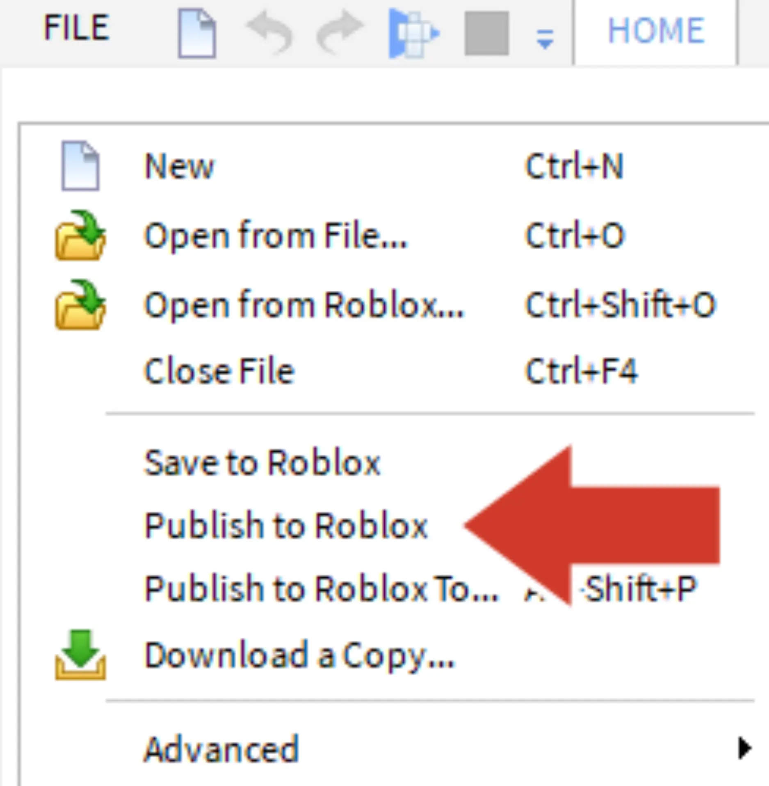
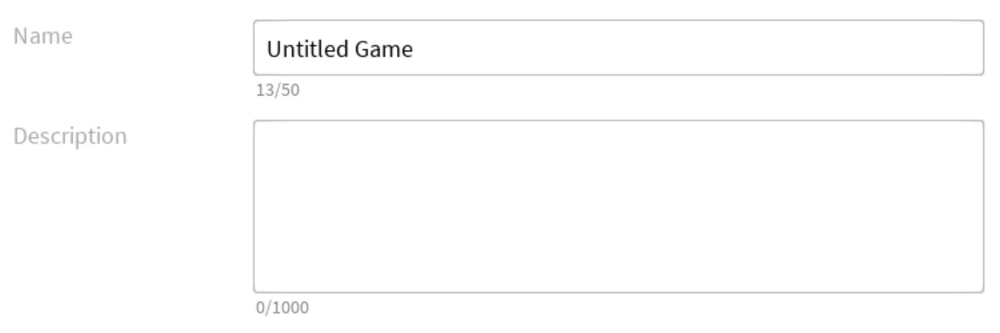
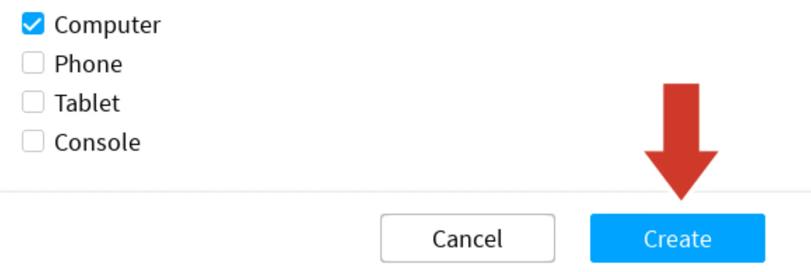

# Save and Publish

## 목차
- [Save and Publish](#save-and-publish)
  - [목차](#목차)
  - [출처](#출처)
  - [다음](#다음)

---

프로젝트 전체를 Roblox에 **게시(publishing)**하여 저장하는 것이 중요합니다. 작업 중이거나 큰 변경 후에는 10분마다 한 번씩 게시하는 것이 좋습니다.

1. **파일(File)** → **Roblox에 게시(Publish to Roblox)**를 선택하여 게시 창을 엽니다.

   

2. 장소 이름과 선택 사항으로 설명을 입력합니다.

   

3. 준비가 되면 **생성(Create)** 버튼을 클릭합니다.

   

---
## 출처
[Save and Publish](https://create.roblox.com/docs/ko-kr/education/build-it-play-it-create-and-destroy/save-and-publish)

---
## [다음](06_0)
